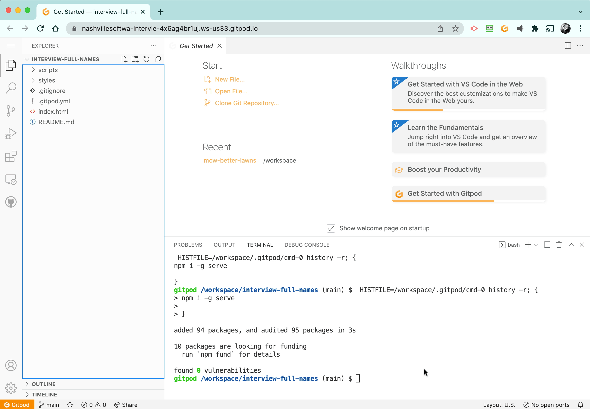

# Raiders of the Lost Locations

## Setting Up

1. Click the Gitpod button above. If requested, authorize with Github.
2. After the virtual machine is set up, a terminal will appear at the bottom of the editor.
3. Enter the command `serve -l 8088` into the terminal to start the web server.
4. A new browser window will open where the code is running.
5. You should immediately open your Dev Tools in this tab.
6. Go back to the editor tab and start a new terminal by clicking the + icon in the lower right portion of the editor _(see animation below)_. Use this terminal to add, commit and push your code. The `git push` command is all you will need to update your repo.

## Testing

The `main.js` module is linked to the `index.html` file, so you can use the debugger in the browser to step through your code like you have been doing during the course.

## Assessment

Open `main.js` and read the instructions contained therein. Remember to use algorithmic thinking and planning, use all of your references, and use your Dev Tools. How you were able to complete the exercise is just as important as completing it.